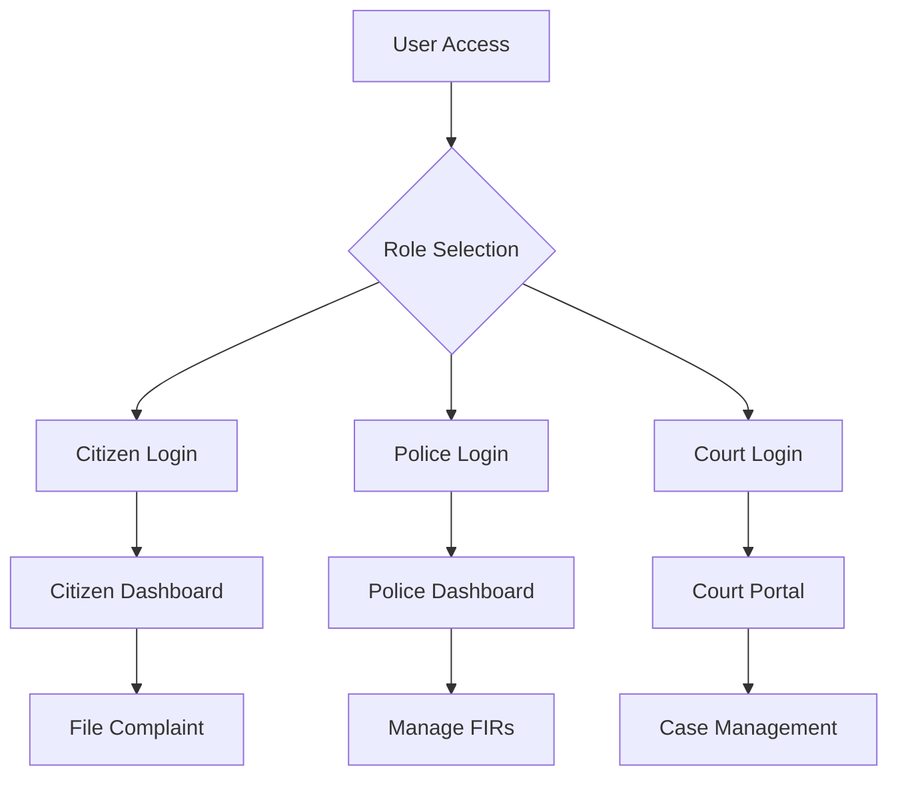

# 🏛️ JusticeChainAI Frontend

<div align="center">


**Revolutionizing Justice Through AI-Powered Technology**

[](https://reactjs.org/)
[](https://nodejs.org/)
[](https://socket.io/)
[](https://styled-components.com/)
[](LICENSE)

*A comprehensive digital justice platform connecting citizens, police, and courts through cutting-edge AI technology*

</div>

---

## 🚀 Overview

JusticeChainAI is a revolutionary full-stack web application that modernizes the justice system by providing a seamless digital platform for citizens, law enforcement, and judicial authorities. Our platform leverages artificial intelligence to enhance case processing, evidence analysis, and legal documentation.

### 🌟 Key Highlights

- **🤖 AI-Powered Features**: Document summarization, NLP translation, crime identification, and delay prediction
- **🔐 Multi-Role Authentication**: Secure access for citizens, police officers, and court officials
- **📱 Real-Time Notifications**: Instant updates via Socket.io integration
- **📄 Evidence Management**: Secure digital evidence locker with file upload capabilities
- **📊 Case Tracking**: Comprehensive case status monitoring and progress tracking
- **🌐 Modern UI/UX**: Responsive design with intuitive user experience

---

## 🏗️ Architecture

```
JusticeChainAI Frontend
├── 📁 src/
│   ├── 🧩 components/          # Reusable UI components
│   ├── 📄 pages/              # Route-specific page components
│   ├── 🔄 contexts/           # React context providers
│   └── 🎨 styles/             # Global styles and themes
├── 📁 public/                 # Static assets and images
└── 📁 docs/                   # Documentation and guides
```

---

## 🛠️ Technology Stack

### Frontend Technologies
- **React 19.1.1** - Modern UI library with latest features
- **React Router DOM 7.9.1** - Client-side routing
- **Styled Components 6.1.19** - CSS-in-JS styling solution
- **Socket.io Client 4.7.4** - Real-time bidirectional communication
- **React Testing Library** - Comprehensive testing utilities

### Key Features
- **Responsive Design** - Mobile-first approach
- **Component Architecture** - Modular and reusable components
- **State Management** - React Context API for global state
- **Real-time Updates** - Live notifications and status updates
- **File Upload** - Drag-and-drop evidence upload system
- **Authentication** - JWT-based secure authentication

---

## 🎯 Features by User Role

### 👥 Citizens
- **📝 File Complaints** - Easy complaint registration with evidence upload
- **📊 Track Cases** - Real-time case status monitoring
- **🔍 Case Status Lookup** - Public case information access
- **🤖 AI Summarizer** - Automatic document summarization
- **🌐 NLP Translation** - Multi-language document translation
- **⏱️ Delay Predictor** - AI-powered case timeline predictions

### 👮 Police Officers
- **📋 Dashboard** - Comprehensive case management interface
- **📄 Manage FIRs** - First Information Report management
- **🔒 Evidence Locker** - Secure digital evidence storage
- **📤 Upload Evidence** - Evidence collection and submission
- **🔍 Crime Identifiers** - AI-assisted crime classification
- **📊 Analytics** - Case statistics and performance metrics

### ⚖️ Court Officials
- **🏛️ Court Portal** - Judicial case management system
- **📋 Case Files** - Comprehensive case file management
- **📅 Hearing Management** - Schedule and manage court hearings
- **📜 Judgment Recording** - Digital judgment documentation
- **🔍 Evidence Review** - Secure evidence examination
- **📊 Case Analytics** - Judicial performance insights

---

## 🚀 Getting Started

### Prerequisites
- **Node.js** (v16 or higher)
- **npm** or **yarn**
- **MongoDB** (for backend)
- **Git**

### Installation

1. **Clone the repository**
   ```bash
   git clone https://github.com/your-username/JusticeChainAI.git
   cd JusticeChainAI/frontend
   ```

2. **Install dependencies**
   ```bash
   npm install
   # or
   yarn install
   ```

3. **Environment Setup**
   Create a `.env` file in the root directory:
   ```env
   REACT_APP_API_URL=http://localhost:5000
   REACT_APP_SOCKET_URL=http://localhost:5000
   ```

4. **Start the development server**
   ```bash
   npm start
   # or
   yarn start
   ```

5. **Open your browser**
   Navigate to [http://localhost:3000](http://localhost:3000)

### Backend Setup
Ensure the backend server is running on port 5000. See the [backend README](../backend/README.md) for detailed setup instructions.

---

## 📱 Available Scripts

| Command | Description |
|---------|-------------|
| `npm start` | Start development server |
| `npm run build` | Build production bundle |
| `npm test` | Run test suite |
| `npm run eject` | Eject from Create React App |

---

## 🎨 UI Components

### Core Components
- **Navbar** - Navigation with role-based menu items
- **ProtectedRoute** - Route protection based on user roles
- **NotificationBell** - Real-time notification system
- **UploadDropzone** - Drag-and-drop file upload
- **AuthContext** - Global authentication state management

### Page Components
- **Home** - Landing page with feature showcase
- **Login** - Multi-role authentication interface
- **Dashboard** - Role-specific dashboards
- **Case Management** - Case tracking and management
- **AI Tools** - AI-powered feature interfaces

---

## 🔐 Authentication Flow



---

## 🤖 AI Features

### 1. Document Summarizer
- Automatically summarizes legal documents
- Extracts key points and important information
- Supports multiple document formats

### 2. NLP Translation
- Multi-language document translation
- Legal terminology preservation
- Real-time translation capabilities

### 3. Crime Identifier
- AI-powered crime classification
- Pattern recognition for case categorization
- Evidence-based crime analysis

### 4. Delay Predictor
- Machine learning-based case timeline prediction
- Historical data analysis
- Resource allocation optimization

---

## 📊 Real-Time Features

### Socket.io Integration
- **Live Notifications** - Instant case status updates
- **Real-time Chat** - Communication between stakeholders
- **Live Case Updates** - Status changes broadcasted instantly
- **Evidence Notifications** - New evidence upload alerts

### Notification Types
- New complaint assignments
- FIR filing confirmations
- Court hearing schedules
- Case status changes
- Evidence submission alerts

---

## 🎨 Design System

### Color Palette
```css
Primary: #191919 (Dark Gray)
Secondary: #2C2C2C (Medium Gray)
Accent: #FF6B35 (Orange)
Success: #4CAF50 (Green)
Warning: #FF9800 (Amber)
Error: #F44336 (Red)
```

### Typography
- **Headings**: Montserrat (Bold, Modern)
- **Body**: Open Sans (Readable, Clean)
- **Code**: Fira Code (Monospace)

### Components
- **Cards** - Information containers with subtle shadows
- **Buttons** - Consistent styling with hover effects
- **Forms** - Clean input fields with validation
- **Modals** - Overlay components for important actions

---

## 📱 Responsive Design

### Breakpoints
- **Mobile**: 320px - 768px
- **Tablet**: 768px - 1024px
- **Desktop**: 1024px+

### Mobile-First Approach
- Touch-friendly interface elements
- Optimized navigation for small screens
- Swipe gestures for mobile interactions
- Progressive Web App (PWA) capabilities

---

## 🧪 Testing

### Test Coverage
- **Component Tests** - Individual component functionality
- **Integration Tests** - Component interaction testing
- **E2E Tests** - Full user journey testing
- **Accessibility Tests** - WCAG compliance verification

### Running Tests
```bash
# Run all tests
npm test

# Run tests with coverage
npm test -- --coverage

# Run tests in watch mode
npm test -- --watch
```

---

## 🚀 Deployment

### Production Build
```bash
npm run build
```

### Deployment Options
- **Vercel** - Zero-config deployment
- **Netlify** - Static site hosting
- **AWS S3** - Scalable cloud hosting
- **Heroku** - Full-stack deployment

### Environment Variables
```env
REACT_APP_API_URL=https://your-api-domain.com
REACT_APP_SOCKET_URL=https://your-api-domain.com
REACT_APP_ENVIRONMENT=production
```

---

## 🤝 Contributing

We welcome contributions! Please see our [Contributing Guidelines](CONTRIBUTING.md) for details.

### Development Workflow
1. Fork the repository
2. Create a feature branch
3. Make your changes
4. Add tests for new functionality
5. Submit a pull request

### Code Standards
- **ESLint** - Code linting and formatting
- **Prettier** - Code formatting
- **Husky** - Git hooks for quality assurance
- **Conventional Commits** - Standardized commit messages

---

## 📄 License

This project is licensed under the ISC License - see the [LICENSE](LICENSE) file for details.

---

## 👥 Team

<div align="center">

**JusticeChainAI Development Team**

| Role | Name | Contribution |
|------|------|-------------|
| **Project Lead** | [Your Name] | Architecture & Backend |
| **Frontend Lead** | [Frontend Dev] | React Development |
| **AI Engineer** | [AI Dev] | Machine Learning Features |
| **UI/UX Designer** | [Designer] | User Experience Design |
| **DevOps Engineer** | [DevOps] | Deployment & Infrastructure |

</div>

---

## 📞 Support & Contact

- **Email**: support@justicechain.ai
- **Documentation**: [docs.justicechain.ai](https://docs.justicechain.ai)
- **Issues**: [GitHub Issues](https://github.com/your-username/JusticeChainAI/issues)
- **Discord**: [Join our community](https://discord.gg/justicechain)

---

## 🙏 Acknowledgments

- **Open Source Community** - For the amazing tools and libraries
- **Legal Professionals** - For domain expertise and feedback
- **AI Researchers** - For advancing legal technology
- **Beta Testers** - For valuable feedback and testing

---

<div align="center">

**Built with ❤️ for a better justice system**

[⬆ Back to Top](#-justicechainai-frontend)

</div>
